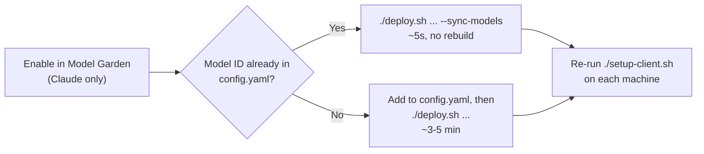

# Antigravity Enterprise Gateway — LiteLLM on Cloud Run

Deploy a **LiteLLM Proxy** on **Google Cloud Run** for the **Antigravity CLI (`agy`)** with one command.

> [!NOTE]
> **This is not an official Google product.** It's a personal, community project to make this setup easier for everyone. It isn't supported or endorsed by Google, so use it at your own discretion.

- 🧠 **Choose your models:** decide which models developers see, set the default, and route to Gemini, Claude, or external providers behind one endpoint.
- 💰 **Control the budget:** set per-developer or per-team limits, and send simple tasks to cheaper models.
- 🔒 **Pass the security audit:** no Google credentials on laptops; every request is authenticated and stays in your own GCP project.

Models are served from **Gemini Enterprise Agent Platform (formerly Vertex AI)**, written as **Vertex AI / GEAP** below. The gateway is the open-source [LiteLLM Proxy](https://docs.litellm.ai/docs/simple_proxy) (upstream image `ghcr.io/berriai/litellm`, pinned to v1.105.0), configured for Antigravity's Google GenAI wire protocol.

**Contents:** [Quickstart](#quickstart) · [Managing Models](#managing-models) · [deploy.sh Reference](#deploysh-reference) · [Security](#authentication--security) · [Architecture](#architecture) · [Going Further](#going-further) · [Troubleshooting](#troubleshooting)

---

## Quickstart

### 0. Prerequisites

- [`gcloud`](https://cloud.google.com/sdk/docs/install), `curl`, `openssl`, and `awk` installed, and logged in with `gcloud auth login`.
- A GCP project with **billing enabled**, where you are **Owner** (or Editor + Security Admin).
- *Optional:* to use Claude, enable the models you want in [Model Garden](https://console.cloud.google.com/vertex-ai/model-garden) (open the model card and click **Enable**). Gemini works without this step. You can also do it later (see [Managing Models](#managing-models)).

### 1. Deploy

```bash
./deploy.sh --project YOUR_GCP_PROJECT_ID
```

Takes ~3–5 minutes and is safe to re-run. It deploys the gateway, checks which models in [`config.yaml`](config.yaml) are enabled in your project, and writes two files for your machine: **`admin_settings.json`** and **`gateway.env`**. Each file contains only the models that actually work. See [what it does step by step](#what-deploysh-does).

### 2. Connect `agy` (one time per machine)

**Linux / macOS**: run as your normal user (**not** with `sudo`; the script asks for `sudo` itself for the one system file):
```bash
./setup-client.sh
```

That's it. Open any new terminal (bash, zsh, tmux, IDE terminals) and `agy models` already shows your gateway models. There's nothing to `source`, ever. Re-run it only when the model list changes (see [Managing Models](#managing-models)).

What it does, so there are no surprises:
- Installs `admin_settings.json` to `/etc/antigravity/` (macOS: `/Library/Application Support/Antigravity/`) with mode `644`. This is the only step that needs `sudo`.
- Writes `~/.config/antigravity/gateway-models.sh` with `AGY_LLM_GATEWAY_MODELS`, the one variable `agy` needs to list partner models like `claude-opus-5`. It contains **model IDs only, no API key**. The URL, key and headers come from `admin_settings.json`.
- Adds one clearly marked block to `~/.zshenv`, `~/.bashrc` (and `fish`/`systemd --user` if present) that loads that file. Every file it edits is backed up first (`<file>.agy-backup-<timestamp>`), and re-running changes nothing if nothing differs.
- Checks that a brand-new shell really sees the models.

Useful options: `--dry-run` (preview, write nothing), `--status` (diagnose), `--uninstall` (remove everything it added; the system file is left for you to remove). Setting up a teammate's machine? Send them `admin_settings.json`, `gateway.env` and `setup-client.sh` in one folder and have them run it.

**Windows** (PowerShell as Administrator):
```powershell
New-Item -ItemType Directory -Force -Path "$env:ProgramData\Antigravity"
Copy-Item admin_settings.json "$env:ProgramData\Antigravity\admin_settings.json"

# Persist only the (non-secret) model list for your user; applies to every new terminal
$models = (Select-String -Path gateway.env -Pattern '^export AGY_LLM_GATEWAY_MODELS="(.*)"$').Matches[0].Groups[1].Value
[Environment]::SetEnvironmentVariable('AGY_LLM_GATEWAY_MODELS', $models, 'User')
```
Open a new terminal afterwards. Environment variables set this way are only picked up by programs started after the change.

> [!IMPORTANT]
> **Both parts matter, and `setup-client.sh` handles both.** `admin_settings.json` points `agy` at the gateway (URL + API key) and must be readable by everyone (mode `644`). If it's root-only, `agy` silently falls back to the consumer model list. `AGY_LLM_GATEWAY_MODELS` is how `agy` discovers partner models like `claude-opus-5`. Without it you still talk to the gateway, but `agy models` shows only the built-in Gemini models, and a saved default like `claude-opus-5-5` is quietly swapped for a Gemini model.
>
> **Don't put the API key in a world-readable shell file** (for example `/etc/profile.d/`). It isn't needed there.

### 3. Verify

```bash
agy models                                                    # should list ONLY your active gateway models
agy --model gemini-3.8-flash-low -p "Explain binary search"   # Claude Sonnet 5 (via gemini-3.8-flash alias)
agy --model gemini-3.7-flash-low -p "Explain binary search"   # Claude Opus 5.5 (via gemini-3.7-flash alias)
```

`deploy.sh` prints the exact test commands for the models that are active in your project.

---

## Managing Models

### How it works

A model shows up in `agy models` only if it passes three checks, in this order:

| Layer | Where | What it controls | How to apply a change |
| :--- | :--- | :--- | :--- |
| **1. Model Garden** | GCP Console | Whether your project is *allowed* to call a partner model (Claude). Gemini is always allowed. | Click **Enable** on the model card |
| **2. `config.yaml`** | This repo, **baked into the container** | Which models the gateway *knows about*, plus aliases and fallbacks | Full `./deploy.sh` (~3–5 min) |
| **3. `admin_settings.json` + `gateway.env`** | Each developer's machine | Which models `agy` *shows*. Generated: models from layer 2 that pass layer 1 | Re-run `./setup-client.sh` |

> [!IMPORTANT]
> `deploy.sh` only checks models **listed in `config.yaml`**. Model Garden has no "list everything I enabled" API, so a model you enable there that isn't in `config.yaml` is **never discovered**. Add it to `config.yaml` first.

### Which command do I run?

Always work top-down: **Model Garden → gateway → your machine.**



| I want to... | Do this | Then run | Rebuild? |
| :--- | :--- | :--- | :--- |
| **Use a model that's already in `config.yaml`** *(e.g. `claude-opus-5-5`, `claude-fable-5`)* | Enable it in [Model Garden](https://console.cloud.google.com/vertex-ai/model-garden) | `./deploy.sh --project P --service S --sync-models` | No, ~5s |
| **Add a model that's not in `config.yaml`** *(new release, or one of the commented-out ones)* | Enable it in Model Garden (Claude), then add it under `model_list` in `config.yaml` ([example](#adding-a-model)) | `./deploy.sh --project P --service S` | Yes, ~3–5 min |
| **Remove a model for everyone** | Delete its block from `model_list` (and from `fallbacks`) | `./deploy.sh --project P --service S` | Yes, ~3–5 min |
| **Hide a model on my machine only** | Remove it from `AGY_LLM_GATEWAY_MODELS` in `gateway.env` | `./setup-client.sh` | No |

After any of the first three rows, finish on each machine with:
```bash
./setup-client.sh
```

### Reading the model check output

Step 6 of `deploy.sh` prints one line per model in `config.yaml`:

| Status | Meaning | What to do |
| :--- | :--- | :--- |
| `✓ ACTIVE` | Enabled, has quota, and answered a direct test request (with fallbacks disabled). Written to your client files. | Nothing |
| `○ INACTIVE` | Listed in `config.yaml`, but the project can't serve it yet: `HTTP 404/403` means not enabled in Model Garden (or wrong Model ID); `HTTP 429` means enabled in Model Garden, but your GCP project has `0` quota (or exhausted quota) for that base model. | For `404/403`: enable it in Model Garden. For `429`: request quota in **IAM & Admin → Quotas**. Then run `--sync-models`. |
| `✗ NOT DEPLOYED` | *(only with `--sync-models`)* It's in your local `config.yaml` but not in the running gateway, because you edited the file after the last full deploy. | Run a full `./deploy.sh` |

### What if a model in `config.yaml` isn't enabled?

Nothing breaks. That's by design, and it's why the default `config.yaml` lists Claude models that most projects haven't enabled yet:

- **It's hidden from users.** It's marked `○ INACTIVE` and left out of `admin_settings.json` / `gateway.env`, so it never appears in `agy models`.
- **The deploy still succeeds.** Claude tests are *skipped* (not failed) when a model isn't enabled. A project with no Claude enabled gets a working Gemini-only setup.
- **It costs nothing.** Calls to a model that isn't enabled fail before they're billed. Each active model gets one tiny test request per deploy or sync.
- **Enabling it later is fast.** Because it's already in `config.yaml`, `--sync-models` picks it up in ~5s with no rebuild.

Minor side effects, all harmless:
- The gateway's own `GET /v1/models` still lists every model in `config.yaml`. Calling a disabled one directly (curl, other OpenAI-compatible tools) returns an error.
- A fallback that points at a disabled model (e.g. `claude-opus-5 → claude-sonnet-5`) just fails, and the original error is returned.

### Model families

| Family | Models in `config.yaml` | Needs Model Garden activation? |
| :--- | :--- | :--- |
| **Google Gemini** *(Vertex AI / GEAP)* | `gemini-3.8-flash`, `gemini-3.7-flash`, `gemini-3.1-pro-preview` | **No.** Enabled automatically with the `aiplatform.googleapis.com` API. |
| **Anthropic Claude** *(Vertex AI / GEAP partner)* | `claude-sonnet-5`, `claude-opus-5`, `claude-opus-5-5`, `claude-fable-5`. Commented out: `claude-sonnet-4-6`, `claude-opus-4-6`, `claude-haiku-4-5@20251001` | **Yes, once per project.** |
| **External providers** *(Anthropic API, OpenAI, AWS Bedrock, Azure OpenAI, ...)* | Commented-out examples in `config.yaml` section 4 | **N/A, and not part of this repo's one-command flow.** LiteLLM supports [100+ providers](https://docs.litellm.ai/docs/providers), so they can sit behind the same gateway and `agy` setup. You bring the provider API key. Traffic leaves GCP and is billed by that provider. |

> [!NOTE]
> **Why Antigravity model IDs use `gemini-*` aliases:**  
> Antigravity CLI (`agy` v1.2.16) only sends native tools (`functionDeclarations`) for model IDs in its built-in catalog (`gemini-3.8-flash`, `gemini-3.7-flash`, `gemini-3.1-pro-preview`). Any custom partner model ID (such as `claude-sonnet-5` or `claude-opus-5-5`) causes `agy` to assign `ToolFormatterType = 4` (`TOOL_FORMATTER_TYPE_CHAT_TRANSCRIPT`) and strip all native tool declarations (`tools: null`). Without native tool schemas, Claude hallucinates plain text tool calls (e.g. `ls_dir`) that never execute.
> 
> To enable full native tool calling in `agy`, the gateway aliases built-in Gemini model IDs to Claude on the backend:
> - **`gemini-3.8-flash`** (displayed as **`Claude Sonnet 5`**) → routes to `vertex_ai/claude-sonnet-5`
> - **`gemini-3.7-flash`** (displayed as **`Claude Opus 5.5`**) → routes to `vertex_ai/claude-opus-5-5`
> - **`gemini-3.1-pro-preview`** (displayed as **`Gemini 3.1 Pro`**) → routes to `vertex_ai/gemini-3.1-pro-preview`
> 
> Direct `claude-*` routes remain configured in `config.yaml` for non-agy clients (curl, OpenAI SDK), but are not advertised to `agy` to prevent tool execution failures.

### Adding a model

1. *(Claude)* Enable it in [Model Garden](https://console.cloud.google.com/vertex-ai/model-garden) and copy the **Model ID** from the card.
2. Add it under `model_list` in `config.yaml`. The `model_name` is what users type in `agy --model`:
   ```yaml
   # Vertex AI / GEAP model (Gemini or Model Garden partner)
   - model_name: claude-haiku-4-5@20251001
     litellm_params:
       model: vertex_ai/claude-haiku-4-5@20251001
       vertex_project: os.environ/GCP_PROJECT_ID
       vertex_location: global

   # External provider (needs its API key in the container, see note below)
   - model_name: gpt-4o
     litellm_params:
       model: openai/gpt-4o
       api_key: os.environ/OPENAI_API_KEY
   ```
3. Run a full deploy, then re-run the client setup on each machine:
   ```bash
   ./deploy.sh --project YOUR_GCP_PROJECT_ID --service YOUR_SERVICE_NAME
   ./setup-client.sh
   ```

> [!NOTE]
> **External providers** also need their API key available to the container: store it in Secret Manager, grant `antigravity-gateway-sa` `roles/secretmanager.secretAccessor` on it, and add it to `--set-secrets` in `deploy.sh` (e.g. `OPENAI_API_KEY=openai-api-key:latest`). Setting that up is outside this repo's scope.

---

## deploy.sh Reference

### Flags

| Flag | Default | Purpose |
| :--- | :--- | :--- |
| `-p, --project <ID>` | `gcloud config` project | Target GCP project |
| `-s, --service <NAME>` | `antigravity-enterprise-gateway` | Cloud Run service name (run several gateways side by side) |
| `-r, --region <REGION>` | `us-central1` | Cloud Run region |
| `-k, --api-key <KEY>` | reuse / generate | Set or [rotate](#rotating-the-api-key) the gateway API key |
| `-m, --min-instances <N>` | `0` | Keep `N` instances warm to avoid ~10–20s cold starts (costs money) |
| `-S, --sync-models` | off | **Fast sync (~5s):** no rebuild. Re-checks the models already in the **deployed** `config.yaml` and regenerates the client files. **Can't add new models.** |

### What deploy.sh does

| Step | Full deploy | `--sync-models` |
| :--- | :---: | :---: |
| 1. Pre-flight checks (tools, `gcloud` login, project access) | ✓ | ✓ |
| 2. Enable APIs: `run`, `aiplatform`, `cloudbuild`, `artifactregistry`, `secretmanager` | ✓ | — |
| 3. Create service account `antigravity-gateway-sa` (only `roles/aiplatform.user`) | ✓ | — |
| 4. Generate or reuse a 256-bit gateway API key in Secret Manager (`antigravity-gateway-api-key`) | ✓ | reads it |
| 5. Build and deploy the container (`config.yaml` + `callbacks.py`) to Cloud Run | ✓ | — |
| 6. Check each model in `config.yaml`: `✓ ACTIVE` / `○ INACTIVE` / `✗ NOT DEPLOYED` | ✓ | ✓ |
| 7. Write `admin_settings.json` + `gateway.env` with only the active models | ✓ | ✓ |
| 8. Run `scripts/test_gateway.sh` (health, auth, Gemini + Claude streaming, tool calls) | ✓ | ✓ |

---

## Authentication & Security

**In short: LiteLLM checks a static API key on every request (not IAP).**

```
agy  ──  Authorization: Bearer <apiKey>   (from admin_settings.json / AGY_LLM_GATEWAY_API_KEY)
  ▼
Cloud Run  (public HTTPS, Google-managed TLS)
  ▼
LiteLLM auth check against LITELLM_MASTER_KEY (injected from Secret Manager at startup)
  ├── no key     → 401
  ├── wrong key  → rejected (400 "No connected db" without a DB, 401 with one)
  └── valid key  → routed to the model
  ▼
Vertex AI / GEAP, called as the Cloud Run service account.
No Google credentials ever reach a developer's machine.
```

| Layer | Protection |
| :--- | :--- |
| **Who can call the gateway** | The API key. Every model endpoint (`/v1beta/*`, `/v1/*`, `/health`, `/metrics`, key management) requires it. Only `/health/liveliness`, `/health/readiness`, the Swagger UI at `/` and the static `/ui` shell are public. None of them expose secrets or models. |
| **Where the key lives** | Secret Manager (`antigravity-gateway-api-key`). Only the gateway's service account can read it. On laptops it's in `admin_settings.json` / `gateway.env`. |
| **What the gateway can do in GCP** | Only `roles/aiplatform.user`, through its own service account |
| **Transport** | HTTPS only |

**Why not IAP?** [IAP](https://cloud.google.com/run/docs/securing/identity-aware-proxy-cloud-run) needs a short-lived per-user Google OIDC token, but Antigravity's gateway setting sends a **static** API key (`apiKey` + optional `customHeaders`). An IAP-protected gateway would reject the CLI.

### Rotating the API key
```bash
./deploy.sh --project YOUR_GCP_PROJECT_ID --api-key "sk-agy-$(openssl rand -hex 32)"
```
This stores the new key, rolls out a new revision, **disables the old key**, and regenerates the client files. Then send the new files to your developers.

### Hardening for production
| Concern | Recommendation |
| :--- | :--- |
| One shared key | Add Postgres to get **per-developer virtual keys** with budgets and rate limits ([see below](#per-developer-keys-budgets--admin-ui)). Keep the master key for admins. |
| Network access | Put the service behind an HTTPS Load Balancer + **Cloud Armor** IP allowlist, then `gcloud run services update SERVICE --ingress internal-and-cloud-load-balancing`. Or use `--ingress internal` if everyone connects over VPN / Interconnect. |
| API explorer | Add `NO_DOCS=True` to `--set-env-vars` in `deploy.sh` to disable the Swagger UI. |
| Org blocks public services | Handled automatically: if *Domain Restricted Sharing* blocks `allUsers`, `deploy.sh` switches to `--no-invoker-iam-check`. The API key is still enforced. |

---

## Architecture

```
┌─────────────────────────────────────────────────────────────────────────┐
│                 Developer Workstation (Antigravity CLI)                 │
│  Reads /etc/antigravity/admin_settings.json + AGY_LLM_GATEWAY_MODELS    │
└───────────────────────────────────┬─────────────────────────────────────┘
                                    │ HTTPS POST /v1beta/models/{model}:streamGenerateContent?alt=sse
                                    │ Header: Authorization: Bearer <gateway API key>
                                    ▼
┌─────────────────────────────────────────────────────────────────────────┐
│                 Google Cloud Run — LiteLLM Proxy Server                 │
│           (upstream ghcr.io/berriai/litellm, pinned v1.105.0)           │
│                                                                         │
│  • Auth Guard: Validates Bearer token against Secret Manager key        │
│  • LiteLLM Router (config.yaml):                                        │
│      - Resolves model_group_alias (e.g. opus-5 -> claude-opus-5)        │
│      - Automatic retries & fallback chains on 429 / 5xx                 │
│  • Antigravity Protojson Plugin (callbacks.py):                         │
│      - Normalizes protojson tool schemas ("minItems": "2" -> 2)         │
│      - Preserves multi-part system instructions & unique tool_call_ids  │
└──────────────────┬───────────────────────────────────┬──────────────────┘
                   │ Native GenAI Pass-Through         │ GoogleGenAIAdapter Translation
                   │ (Cloud Run Service Account ADC)   │ (Cloud Run Service Account ADC)
                   ▼                                   ▼
     ┌───────────────────────────┐       ┌───────────────────────────┐
     │ Vertex AI / GEAP Gemini   │       │ Model Garden (Partners)   │
     │  • gemini-3.8-flash       │       │  • claude-sonnet-5        │
     │  • gemini-3.7-flash       │       │  • claude-opus-5          │
     │  • gemini-3.1-pro-preview │       │  • claude-opus-5-5        │
     │                           │       │  • claude-fable-5         │
     └───────────────────────────┘       └───────────────────────────┘
```

| File | Purpose |
| :--- | :--- |
| [`config.yaml`](config.yaml) | Model list, aliases, fallbacks, and LiteLLM settings |
| [`callbacks.py`](callbacks.py) | Plugin that normalizes Antigravity's protojson quirks |
| [`Dockerfile`](Dockerfile) | Extends the pinned upstream LiteLLM image |
| [`deploy.sh`](deploy.sh) | One-command deploy, model check, and client-config generator |
| [`admin_settings.example.json`](admin_settings.example.json) | Reference template for the client config |
| [`scripts/test_gateway.sh`](scripts/test_gateway.sh) | End-to-end security, streaming, and tool-calling checks |

---

## Going Further

### Built-in LiteLLM endpoints
- **Swagger / OpenAPI explorer:** `https://<GATEWAY_URL>/`
- **Model list:** `GET https://<GATEWAY_URL>/v1/models` (needs the API key)
- **OpenAI-compatible:** `POST https://<GATEWAY_URL>/v1/chat/completions`. Other tools (Cursor, Continue, LangChain, the OpenAI SDK) can share the gateway.

### Per-developer keys, budgets & Admin UI
The default setup is **stateless** (no database), which is why the Admin UI at `/ui` loads but login fails with *"Not connected to DB"*. To unlock virtual keys, teams, spend tracking, and budgets:

1. Create a Postgres database (e.g. Cloud SQL) and store its connection string in Secret Manager as `litellm-database-url`.
2. Grant `antigravity-gateway-sa` `roles/secretmanager.secretAccessor` on it (plus `roles/cloudsql.client` for Cloud SQL connectors).
3. Add `DATABASE_URL=litellm-database-url:latest` to `--set-secrets` in `deploy.sh` and re-run it. LiteLLM migrates the schema on startup.
4. Log in to `/ui` as `admin` with the master key, create one virtual key per developer, and put *that* key in their client files.

### Upgrading LiteLLM
The base image is pinned by digest in the `Dockerfile`. To upgrade, change `LITELLM_IMAGE`, re-run `./deploy.sh`, and confirm all checks pass.

### Running the verification tests manually
```bash
./scripts/test_gateway.sh https://YOUR-GATEWAY-URL.run.app YOUR_GATEWAY_API_KEY
```
```text
  ✓ PASS: LiteLLM Proxy liveliness check (/health/liveliness) returned 200 OK
  ✓ PASS: Unauthenticated request rejected with HTTP 401 Unauthorized
  ✓ PASS: Invalid API key rejected (HTTP 400)
  ✓ PASS: LiteLLM Proxy model catalog (/v1/models) lists Gemini & Claude models
  ✓ PASS: Gemini 3.8 Flash native GenAI SSE streaming succeeded
  ✓ PASS: Claude Sonnet 5 GenAI-to-Anthropic SSE streaming succeeded
  ✓ PASS: Claude Opus 5 GenAI-to-Anthropic SSE streaming succeeded
  ✓ PASS: Claude Sonnet 5 tool calling with Antigravity protojson schema succeeded
  ✓ PASS: OpenAI-compatible endpoint (/v1/chat/completions) succeeded
```
Claude checks show `○ SKIP` instead of failing when that model isn't enabled in Model Garden.

---

## Troubleshooting

| Symptom | Cause | Fix |
| :--- | :--- | :--- |
| **`agy models` shows only the built-in Gemini models instead of yours** (or your saved default like `claude-opus-5-5` is silently replaced by a Gemini model) | Client setup was never run on this machine, `admin_settings.json` is root-only (`0600`), or `AGY_LLM_GATEWAY_MODELS` isn't set in this terminal (e.g. it was opened before setup ran) | Run `./setup-client.sh --status` to see which part is missing, then `./setup-client.sh`. Open a new terminal afterwards. |
| **Enabled a model in Model Garden, but it's missing after `--sync-models`** | It isn't in the **deployed** `config.yaml`. Either it was never added, or it was added locally after the last full deploy (`✗ NOT DEPLOYED`). | Add the exact Model ID to `config.yaml`, run a full `./deploy.sh`, then re-run `./setup-client.sh` |
| **A model stays `○ INACTIVE` even though it's enabled** | Either `HTTP 429` (enabled in Model Garden, but the project has `0` quota for that base model—common for gated preview models like `claude-fable-5`) or `HTTP 404` (`model_name` doesn't match the Model Garden card ID) | For `429`: request quota for `online_prediction_requests_per_base_model` in **IAM & Admin → Quotas**, then `--sync-models`. For `404`: fix the ID in `config.yaml` and run a full deploy. |
| **`model X is not recognized as a known model or custom model in settings`** | `AGY_LLM_GATEWAY_MODELS` isn't set in this terminal, or the model was inactive when `gateway.env` was generated | `./setup-client.sh --status`. If the model is missing from `AGY_LLM_GATEWAY_MODELS`, enable it, run `--sync-models`, then `./setup-client.sh`. |
| **`--model gemini-3.8-flash requires --effort`** | Gemini 3.x in `agy` needs a thinking tier | Use `gemini-3.8-flash-low` / `-medium` / `-high`, or add `--effort low`. Claude models don't need it. |
| **Claude returns `404` / `403`** | Model not enabled in your project's Model Garden | Enable it on the [Model Garden](https://console.cloud.google.com/vertex-ai/model-garden) card |
| **`401` "No api key passed in"** | Client isn't sending `Authorization: Bearer` | Check `gateway.apiKey` in `/etc/antigravity/admin_settings.json` (re-run `./setup-client.sh` to refresh it) |
| **`400` "No connected db"** | The client's API key doesn't match the gateway key (e.g. after a rotation) | `./deploy.sh --project P --service S --sync-models`, then re-run `./setup-client.sh` |
| **`403 Forbidden` HTML page from Google** | An org policy blocks public Cloud Run services | Re-run `./deploy.sh`; it applies `--no-invoker-iam-check` automatically |
| **First request after idle is slow** | Cloud Run cold start | `./deploy.sh --project P --min-instances 1` |
| **`429` / quota errors** | Vertex AI / GEAP quota exhausted | Fallbacks in `config.yaml` kick in automatically. Request more quota if it keeps happening. |
| **Need server logs** | — | `gcloud run services logs read SERVICE --project=P --region=us-central1 --limit=50` |
